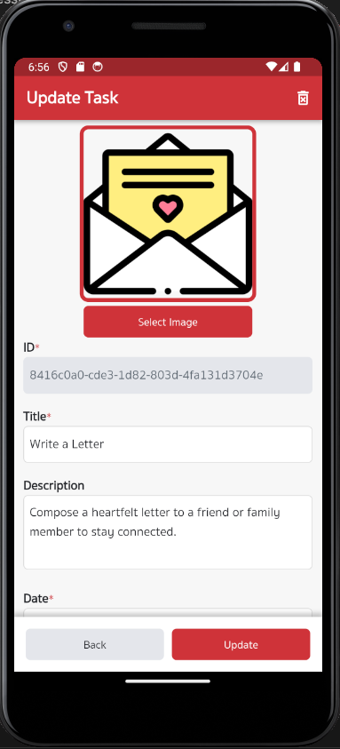

# ToDo App


This is a ToDo app built with Flutter that offers various features for managing your tasks. It includes features like Create, Read, Update, and Delete (CRUD) tasks, supports two languages (English and Thai) with internationalization (i18n), and allows you to search and sort your tasks. The app is designed to be responsive for both mobile and web platforms and follows a clean architecture project structure.

## Features

- **Create, Read, Update, and Delete (CRUD) Tasks**: Manage your tasks with ease. Add, view, update, or remove tasks as needed.

- **Responsive Design**: The app is designed to be responsive and works seamlessly on both mobile and web platforms, ensuring a consistent user experience.

- **Clean Architecture**: The project follows clean architecture principles, making it easy to maintain and scale.

- **Multilingual Support**: The app supports two languages - English and Thai - using internationalization (i18n).

- **Search Tasks**: Easily find specific tasks by searching with titles and descriptions.

- **Sort Tasks**: Organize your tasks by title, date, or status for better task management.

## Technologies Used

- Flutter
- GetX for state management
- Unit tests for code quality assurance

## Getting Started




## Getting Started

To run this app locally, you need to have Flutter installed. Clone the repository and use the following commands:

```bash
flutter pub get
flutter run


